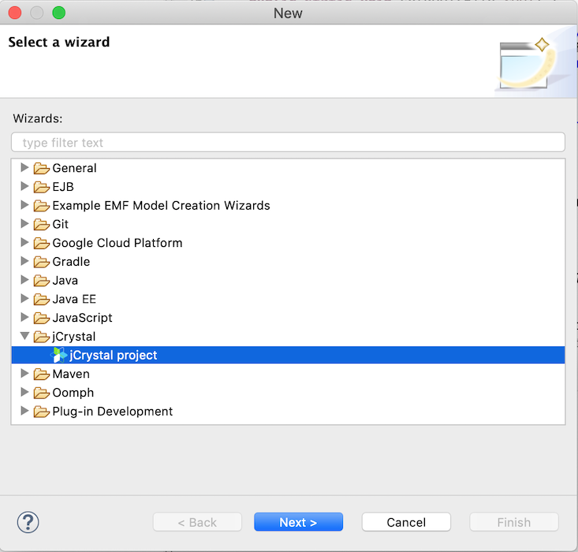

# Creating a new project

## Before you begin

Please make sure you have followed the instructions detailed on [Installation](installation.md).

## Create and setup a key

To use jCrystal you need add a key to your project. To get the key:

1. Sign in or register in jCrystal:
    - [Sign in](https://jcrystal.dev/#/index/login)
    - [Register](https://jcrystal.dev/#/index/registry)

2. Create a new project with the name of your project.

3. Copy the project key, we will use it in the next section.

## Creating a new project

1. Open Eclipse.

2. Go to the menu File then choose `New > Other`.

3. On the dialog, search for jCrystal and select jCrystal project. Then click **Next**.

    

4. On the setup dialog:
    - Enter a Project Name.
    - Enter the jCristal API Key for your project that you previously obtained.
    - Enter a Group ID and Artifact ID.

5. Click **Next**. 

5. On the setup client's dialog, you can define the clients that your project is going to use. A client is defined by:
    - A platform: Android, iOS, Angular.
    - A custom client identifier.
    - A path to the generated code of that client (usually the path of the project of that client).

    If you don't know which clients your project will use, don't worry! You can add the clients later. Also if you add them, you can later change the path of the generated code. :wink:

    Additionally, if you just want to test jCrystal to build a simple backend, you can click **Finish** without selecting any client. 

6. Click **Finish**. 

## Verifying
Your project is ready to be used! :tada: To verify that jCrystal is working:

1. Go to your Package Explorer, select your project and: 
- Pressing  `CTRL + 6` (Windows) or `CMD + 6` (Mac OS).

    or
- Pressing the jCrystal icon. 

2. Open the console view by going to `Window > Show View > Console` you should see something like:

```
UTF-8
Time sending (11): 147 ms
Total time: 804 ms
```

So, what did just happened? jCrystal scanned all your project files to know which code to generate to help you develop your app. 

Refresh and check your project, do you see anything different? 

You will find that your project is the same after running jCrystal: nothing was generated. Why is that? That's because your project is still empty, so jCrystal didn't find anything that could generate that would be useful. Go to the next section to [learn how to run your project and really use jCrystal](run_test.md).


## What's next
- [Learn how to run and test your project](run_test.md).
- Did you encounter an error creating the app? Check our [troubleshooting](troubleshooting.md). 
- [Anatomy of a jCrystal project](anatomy.md).