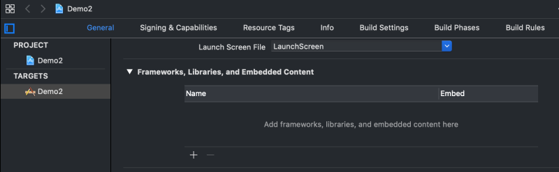
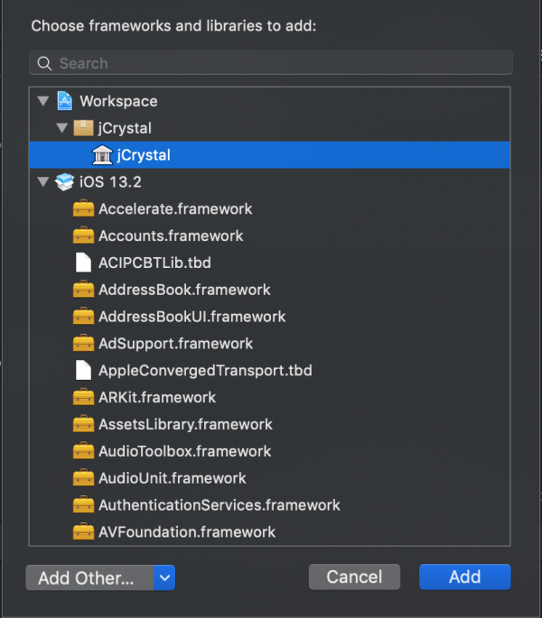

# iOS guide

## Setup

The generated code of jCrystal must be added on the root folder of your iOS application.

1. Open your iOS project on Xcode.
2. Right-click on your project and select "Add files to <Your Project Name>...".
3. On the dialog:
	1. Search and select the jCrystal folder which should be on the root folder of your project. 
	2. Select the option "Create folder references".
	3. Click **Add**.
4. Go to your project's target general settings and on the "Frameworks, Libraries and Embedded Content" section click "+".



5. On the dialog, select jCrystal and click **Add**. 


Now you can integrate with your backend. 

## Consuming Services
Call your the web services generated by jCrystal in the following way:

```swift
    ManagerHello.ping(onSuccess: { (resp) in
        //On success
    }) { (error) in
        //On error
    }
```

jCrystal can manage the error handling on a UIViewController, showing an alert with the error message if a web service returns an error. Therefore, if you want jCrystal to manage errors, you don't have to implement the error handler:


```swift
class MyViewController: UIViewController {
...
    ManagerHello.ping(onSuccess: { (resp) in
        //On success
    })
...
}
```

## Additional Utilities

- Scroll utilities.
- Form utilities.