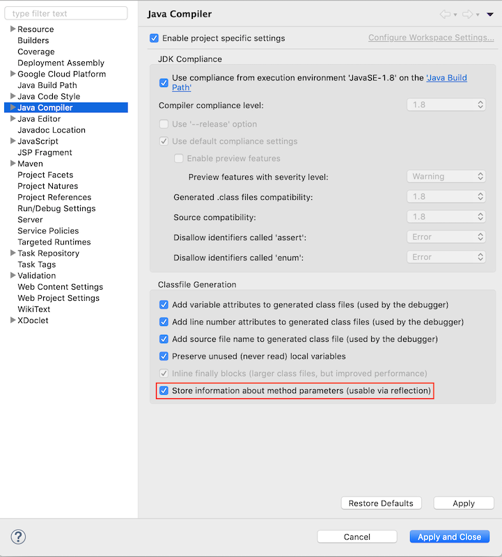

# Part 1

Throughout this tutorial, we’ll walk you through the creation of a backend for a blogging platform and a frontend application that uses said backend.

A blogging platform works by letting users create, read, update and delete articles. For now, we will focus on the articles and not the users that write them, which will be the focus of other parts of this tutorial. Therefore, right now  we want to create a backend that helps us:
- Create, read, delete and update articles.

*Note: This tutorial is loosely based on [RealWorld](https://github.com/gothinkster/realworld), a real-world blogging platform and a Medium.com clone. You can find more information about it [here](https://medium.com/@ericsimons/introducing-realworld-6016654d36b5).*

## Before you begin

Please make sure you have followed the instructions detailed on [Installation](/getting_started/installation.md).

## Creating a new project

1. Open Eclipse.

2. Create a new "Google App Engine Standard Java Project". 

3. On the setup dialog:
    - Enter as the project name "BloggingApp"
    - Check the "Create as Maven Project" option.
    - Enter a "blogging_app" as a Group ID and Artifact ID.

4. Click **Finish**. 

5. Right-click your new project, select `jCrystal > Add dependencies`. 

6. Refresh your project by going to `File > Refresh`.

7. Select the `src/main/utils` folder and add it to your build by right-clicking it and selecting `Build path > Use as Source Folder`. This folder will contain the generated code of your server.

    

8.  If you see any errors, try updating your project from maven by right-clicking project and going to `Maven > Update project`.

### Optional steps

These steps are not mandatory, but can help you enjoy your experience with jCrystal:

1. Right click your project and select `Properties`. On the properties dialog, go to `Java Compiler` and check the option "Store information about method parameters". 

    

2. Click **Apply and Close**. 

3. On the dialog to rebuild the project, click **Yes**.

4. Delete the `Hello App Engine.java` file as well as the **`src/java/tests`** folder. From now on you won't need that much code to create a web service. :wink: 


## Create and setup a key
To use jCrystal you need add a key to your project. To get the key:

1. Sign in or register in jCrystal:
    - [Sign in](https://jcrystal.dev/#/index/login)
    - [Register](https://jcrystal.dev/#/index/registry)

2. Create a new project with the name of your project.

3. Copy the project key.

4. Go to Eclipse, right-click your jCrystal project and select `jCrystal > Dev key`.

5. Paste the key in the dialog an click on the "Ok" button.

## Verifying
Your project is ready to be used! :tada: To verify that jCrystal is working:

1. Go to your Package Explorer, select your project and: 
- Pressing  `CTRL + 6` (Windows) or `CMD + 6` (Mac OS).

    or
- Pressing the jCrystal icon. 

2. Open the console view by going to `Window > Show View > Console` you should see something like:

```
UTF-8
Time sending (11): 147 ms
Total time: 804 ms
```

So, what did just happened? jCrystal scanned all your project files to know which code to generate to help you develop your app. 

Refresh and check your project, do you see anything different? 

You will find that your project is the same after running jCrystal: nothing was generated. Why is that? That's because your project is still empty, so jCrystal didn't find anything that could generate that would be useful. Let's add something :wink: . 

## Creating your first entity

Let's create an Article entity to represent an article in our platform. We will define an article as an object with these properties:
- **Title**: The title of the article (max 250 characters).
- **Description**: A short text that describes what this article is about (max 350 characters).
- **Body**: The text of our article.
- **Slug**: A string that will be unique to each article used to represent that article. More information on slugs can be found on [this Wikipedia article](https://en.wikipedia.org/wiki/Clean_URL#Slug).
- **Number of views**: The number of times this article has been seen (initially cero). 
- **Creation date**: The date when the article was created.

Let's create this entity:

1. Create a new package named `entities` on the `src/main/java` folder on your Eclipse project.

    *Note: all the source code of your application must be on `src/main/java`. You can create additional packages inside that directory, but everything must be there. Check [more details of your application's anatomy here](/getting_started/anatomy.md).*

2. Inside the "entities" package, create a new class named `Article`.
3. Add this annotation to your Article class:

```java
package entities;
import jcrystal.reflection.annotations.jEntity;

@jEntity
public class Article {

}
```

The `@jEntity` lets jCrystal know that this class describes an Entity that will be stored in the database.

4. Let's add the title, description, and body as properties of our article by adding these lines of code in the Article class:

```java
package entities;
import jcrystal.reflection.annotations.jEntity;
import jcrystal.reflection.annotations.EntityProperty;
import com.google.appengine.api.datastore.Text;
@jEntity
public class Article {
	@EntityProperty
	private static String title;
	
	@EntityProperty
	private static String description;

    @EntityProperty
	private static String slug;

	@EntityProperty
	private static int numViews;
	
	@EntityProperty
	private static Text body;
}
```

Both of these elements are required for jCrystal to identify an attribute as a database field of the entity. 

The name of each property will be used by you to get and set the values of that property; additionally, jCrystal will use that name in your database as the column name.

The type of each property lets jCrystal know what kind of data each property holds. Right now, jCrystal supports all Java primitive types and wrapped primitive types, as well as entities, among other types. You can check the full list [here]. 

The `body` attribute has a special type `Text`, that's because the `String` type is limited to 1500 bytes, so to allow an unlimited size to our article's body we use `Text` instead as the type for this property. 


5. Let's see what jCrystal can generate with this entity definition. Run jCrystal by going to your Package Explorer, select your project and: 
    - Pressing `CTRL + 6` (Windows) or `CMD + 6` (Mac OS).

    or
    - Pressing the jCrystal icon. 

Check your `Article` class, it now has about 180 lines of code and you should see  something like this:

```java
...
@jEntity
public class Article implements Entity{
	@EntityProperty
	private static String title;
	
	@EntityProperty
	private static String description;

    @EntityProperty
	private static String slug;

	@EntityProperty
	private static int numViews;
	
	@EntityProperty
	private static Text body;
/* GEN */
	public static final String ENTITY_NAME = "Article";
	protected final com.google.appengine.api.datastore.Entity rawEntity;
	public final com.google.appengine.api.datastore.Entity getRawEntity(){return rawEntity;}
	public Article(com.google.appengine.api.datastore.Entity rawEntity){
		this.rawEntity = rawEntity;
	}
	public Article(){
		rawEntity = new com.google.appengine.api.datastore.Entity(ENTITY_NAME);
	}
	protected Article(String entityName){
		rawEntity = new com.google.appengine.api.datastore.Entity(entityName);
	}
    ...
/* END */
}
```
jCrystal generated all the lines of code below the `/* GEN */` line and above the `/* END */`! Neat, right? 

What are all those lines?  They are methods that will help you use your Article entity from now on. Feel free to check them out, but you don't need to know them, we'll see soon that it's very natural to use them. 

Now, we haven't finished defining our Article class, we still need to add a property to know when the article was created, can we do it even though jCrystal already started to generate code on this class? Sure we can! Just remember that anything that we want to add from now on **must be above the line  `/* GEN */`.** 

Remember, **anything between the lines `/* GEN */` and `/* END */` will be lost when you run jCrystal again.**

6. Add the creation date of our article by adding these lines of code in the Article class **above the line  `/* GEN */`**:


```java
...
@jEntity
public class Article implements Entity{
    ...

    @EntityProperty
    private static CrystalDateTime createdAt;
/* GEN */
...
}
```
CrystalDateTime is a special type used by jCrystal to represent a date and time. jCrystal doesn't support java.util.Date as an EntityProperty type, instead it has it's own classes:
- `CrystalDate`
- `CrystalDateMilis`
- `CrystalDateSeconds`
- `CrystalDateTime`
- `CrystalTime`
- `CrystalTimeMilis`
- `CrystalTimeSeconds`


7. Update your generated code by running jCrystal. Go to your Package Explorer, select your project and: 
    - Pressing `CTRL + 6` (Windows) or `CMD + 6` (Mac OS).

    or
    - Pressing the jCrystal icon. 


    Why do I keep running jCrystal? Every time you add or change something to your entities or web services, you **need** to run jCrystal so that the generated code can be updated according to the changes you made. If you don't run jCrystal, you might end up with a generated code that it's **outdated and that doesn't help you develop faster.***
    *Please check [jCrystal's paradigm to learn more about this.](/getting_started/paradigm.md)

## Adding validations and default values

If you check the definitions that we made of the properties of an article, they included:

- Maximum sizes for the title and the description.
- Default values for the number of views.
- Unique value for the slug of each article. 

Let's see how jCrystal helps to add those validations and default values:

1. Add a maximum validation to the title and description:

```java
...
@jEntity
public class Article implements Entity{
	@EntityProperty
	@MaxValidation(max = 250, value="The title must have 250 characters maximum")
	private static String title;
	
	@EntityProperty
	@MaxValidation(max = 350)
	private static String description;
	...
}
```

As you can see, the only thing you have to do to add a maximum validation is to annotate the property with `@MaxValidation`; to use this annotation you must set the `max` parameter, but optionally you can also set the `value` parameter, which will be used as the exception message if an entity doesn't comply with the validation.

jCrystal also supports the annotation `@MinValidation`.

2. Add the default value for numViews like this:
```java
...
@jEntity
public class Article implements Entity{
	...
    @EntityProperty
	private static int numViews = 0;
	...
}
```

As you can see, to set a default value you only have to set the value of that attribute. Easy, right? :grin: 

3. To let jCrystal know that the `slug` must be unique, do this:
```java
...
@jEntity
public class Article implements Entity{
	...
    @EntityProperty(index = IndexType.UNIQUE_VERIFICATION)
	private static String slug;
	...
}
```
The `index` parameter defines the type of index applied to this field; the value `UNIQUE_VERIFICATON` let's jCrystal know that each field value has only one entity and also jCrystal must ensure the uniqueness of that field.

4. The property `createdAt` must save the date when the article was created. Even though you could initialize this attribute every time you create an Article, jCrystal can do it for you in this way:
```java
...
@jEntity
public class Article implements Entity{
	...
    @EntityProperty(autoNow=true)
    private static CrystalDateTime createdAt;
	...
}
```

The autoNow parameter is only valid for attributes of these types:
- `CrystalDate`
- `CrystalDateMilis`
- `CrystalDateSeconds`
- `CrystalDateTime`
- `CrystalTime`
- `CrystalTimeMilis`
- `CrystalTimeSeconds`

When set to `true` the `autoNow` parameter automatically initializes the attribute with the current time when the instance of the entity is created.